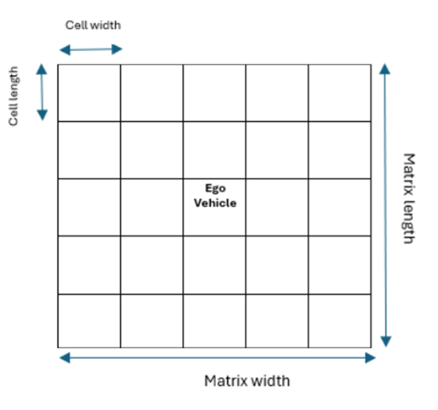

# Carla-Integration-Modules
Integration modules for CARLA, including sumo integration and observation adaptation for real world sensors. Environment also implemented using `Gym` wrapper to facilitate the training process.

## Table of Contents
    1. [Getting Started](#1)
    2. [env](#2)
    3. [Load Open Drive](#3)
    4. [Object Spawn](#4)
    5. [Observation Adapters](#5)
    6. [Vehicle Control](#6)
    7. [Manual Control](#7)

1. ## Getting Started <a name="1"></a>
   to start training process, carla should be running either on screen or off screen in port `2000`. after that, user must run `env.py` or `run_model2.ps1` (windows only) to start the training process. output will be saved in `checkpoints` and training will start from last checkpoint.

   if ports are not available, it may be due to system wifi adapter. you can run `run_loopback` to fix the problem.

2. ## env <a name="2"></a>
   later inshallah
    
3. ## Load Open Drive <a name="3"></a>
   this module is designed to load and opendrive map with xodr format in the carla client. if client is not passed through the parameters, it will attempt to connect client on port 2000.

   xodr files can be ceated using `sumo: netedit` and converted to xodr format using following commands:

    ```python
   netconvert --sumo-net-file map.net.xml --opendrive-output map.xodr
   ```

4. ## Object Spawn <a name="4"></a>
   several modules to spawn objects on road after loading the map.
   - Vehicle: spawns a number of vehicles on the map. spawn points and vehicle types are random and a `carla: traffic manager` is connected to the vehicles to control npc vehicles. keep in mind that traffic manager is not percise and vehicles can crash or get out of the map after a while.
   - Pedestrians: same as VehicleSpawner but for pedestrians.
   - EgoVehicle: spawns the vehicle that will be controlled by RL model in a random spawn point. initial speed can be set here.

5. ## Observation Adapters <a name="5"></a>
    gets observations from carla and converts it to matrices and lists that model can understand. current observation types are as follows:
    - **Object Speeds**: returns 3 matrices. each matrix is a NxN bird-eye view grid that each of it cells translates to a real-world `cell_width` x `cell_length` rectangle (units in meters). presence matrix shows the presence of objects in the grid. empty and off-road cells are annotated with 2 and cars are annotated with 1. matrix is rotated in a way that upside always points to where the vehicle is heading. a potential bug is that when an object doesn't fit to one cell, its not shown in more than one cells.
  
    other two matrices show objects' x and y velocity respectivly.
    - **Traffic Signs:** not implemented. should return a list of signs in a radius of ego vehicle.
    - **Lane Angle:** angle between car heading and road in radians.
1. ## Vehicle Control <a name="6"></a>
   
2. ## Manual Control <a name="7"></a>